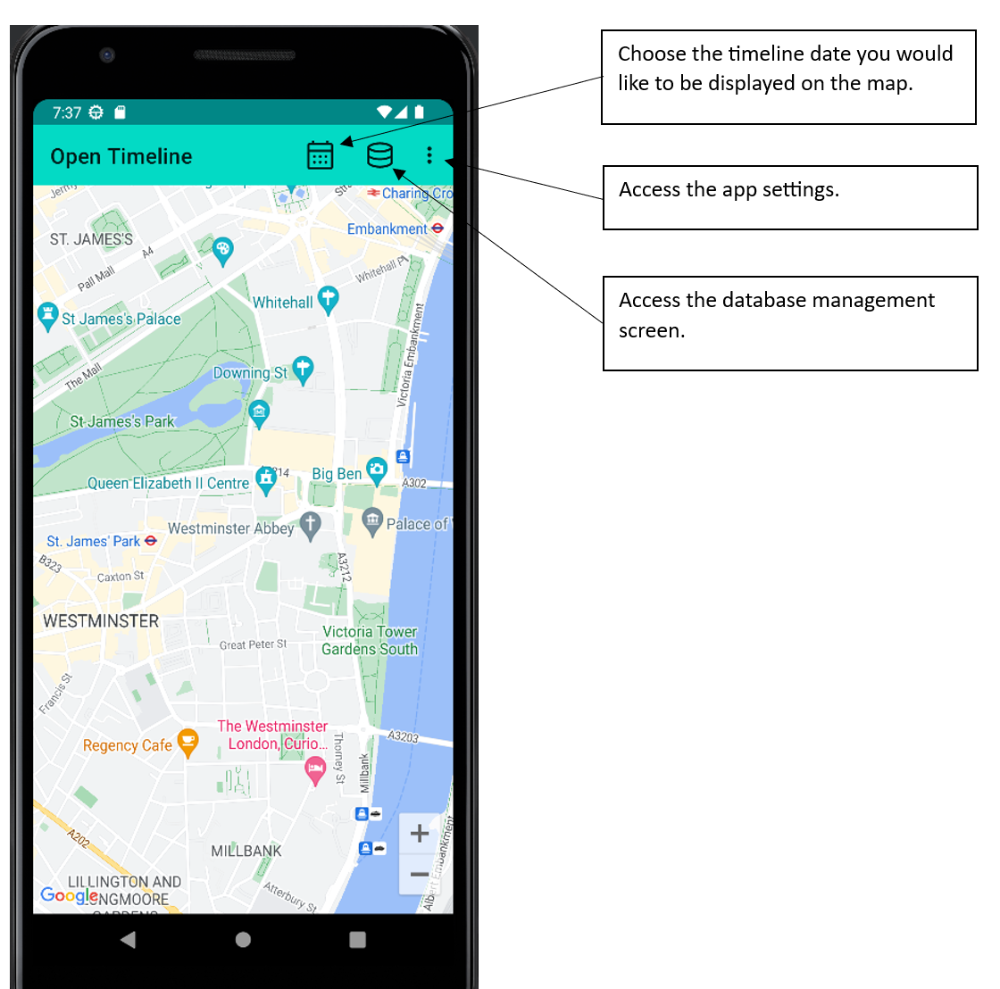
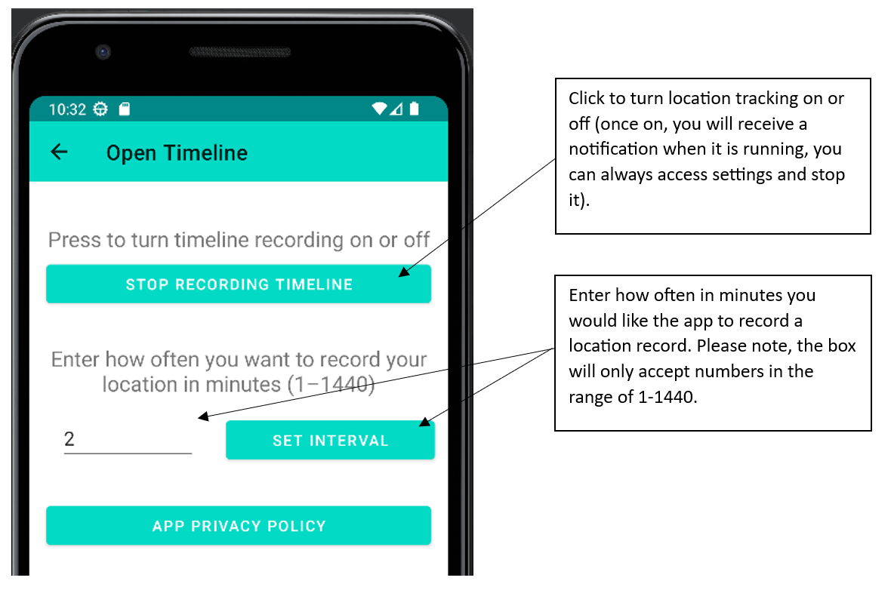
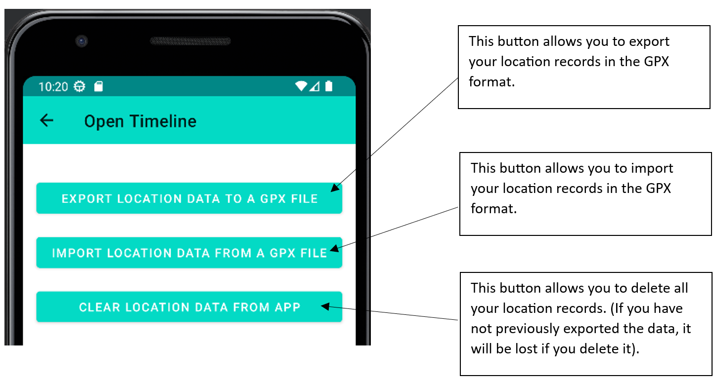
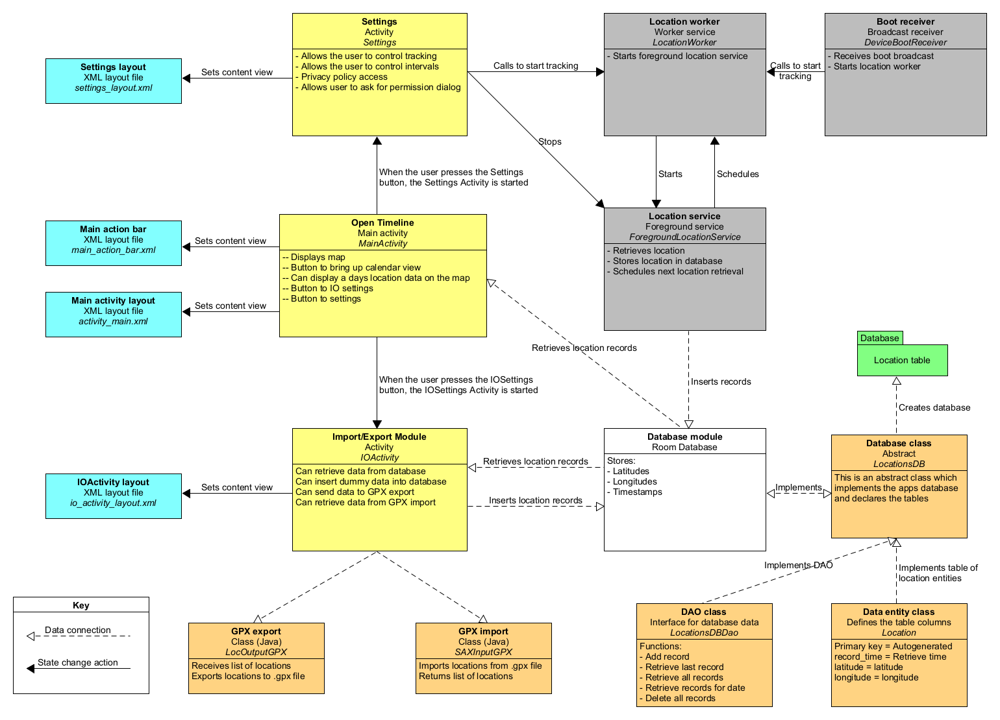

# Welcome to the Open Timeline Android project
The aim of this project is to provide a privacy focused alternative to location timeline products. 

## About
Keeping a record of your location history can be useful and entertaining to explore in the future. Most open source projects which produce tools for recording a user’s timeline, seem to build them around integrating with a remote server, which stores the data. The Open Timeline app on the other hand is developed so it can function fine without any network connection in relation to the location data (downloading of the map requires an internet connection), allowing the user to record, view, manage, export, and import their data at will. 
The apps current feature set:
-	Record users location at regular intervals
-	Display recorded locations for a specific date on a map
-	Export the users location data in GPX format
-	Import the users location data in GPX format

This is currently a personal project, which has been developed to a standard where it is functional, but it is still not perfect, and first-time user’s will need to find their way around the current UI. It is also currently implementing Google Maps. There may be updates in future, which improve the apps usability and features. Feel free to make any suggestions.

## Build guide 
In order to complete this guide, you are going to need to generate a Google Maps API key (https://developers.google.com/maps/get-started/).

1.	Download this repository
2.	Open the repository in Android Studio
3.	Add the following line to the generated “local.properties” file with your API key:
`MAPS_API_KEY=[Your api key here]`
4.	Run the app using the run function of Android studio

## User Guide
This documentation covers navigation around the Open Timeline app.

On first start up you will be asked to approve the following permissions. Not enabling these permissions may impact the apps functionality. 
- “Precise location”, for location accuracy.
- “Notifications”, to allow the service to run in the background.
- “Allow all the time”, for the location settings, once again for the background service to run.
- “Disable battery optimisation”, otherwise the tracking service will fail once the device is rebooted, unless the app is opened on boot by the user.

### The main screen
The main screen allows you interact with the map, select a date to view your timeline for, or access either the apps database management menu or app settings. 
  

### The settings menu
The settings menu allows you to turn timeline tracking on or off, as well as change how often the app collects your location (it’s a trade-off between your battery life and location granularity). There is also an additional option not shown below, which allows you to reset the “Don’t show again” action you may have taken on the permissions dialog (this button is only shown if you have pressed the action).  
  

### The database management menu 
This menu allows you to import/export your data, as well as reset the database so you can have a fresh start. 
  

### Additional information
Once enabled the location service will run in the background, with a notification showing in your notification tray. The location service will automatically start itself on boot if you restart your device and have the service set to run in settings. 

 

## Developer guide
The app is programmed with Kotlin and has a minimum SDK level of 30. The below diagram gives an indication of the app structure. Further details can be found in each of the apps classes.  

The apps internal structure
